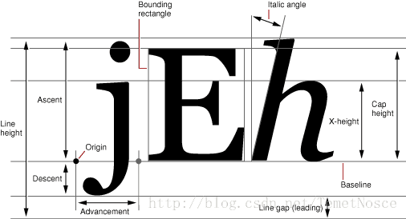

# QFont
应用程序用来指定字体属性的类，字体最重要的属性是family，其余属性是尺寸，磅数(应该是粗体细体)，词间距，字间距，stretch(宽度缩放)
# QFontInfo
实际渲染时使用的字体的属性信息
它与QFont类的属性区别，
QFont类的属性指的是应用程序需求的属性，例如指定使用25Pt的字体，但是实际渲染时可能在操作系统中找不到该字体，只好使用24Pt的字体，QFontInfo返回的就是24Pt，即实际渲染使用的属性
## PixelSize
设定字体大小为像素大小，与设备无关。
## PointSize
设定字体大小的另一种方式，由于精度原因实际渲染效果可能无法达到设定值
## Weight
类似于操作系统或css中指定的字号，从enum QFont::Weight中获取数值，大概数值从0到87，字体从thin到bold。
## fixedPitch
等宽字体
# QFontMetrics
用于计算字符和字符串的size。注意区分打印机字体和适用于屏幕的字体

baseline就是基线
Ascent就是基线到字符最高处距离
descent就是基线到字符最低处距离
leading应该是上一行的最低到下一行的最高距离，能否理解为行距
lineHeight就是字符高度加行距
使用QPainter绘制文本，drawText的时候，文字坐标系原点是Origin，也就是基线上的点，而不是文本左上角
width就是字符串文本的总宽度
如果设定了自动换行，在知道宽度的基础上，boundingRect可以计算出字符串文本的总高度
所以在一个矩形中绘制自动换行的文本，可以先设定宽度，再boundingRect来计算文本的高度，从而绘制外包围矩形
```
QFont f;
f.setPixelSize(30);
f.setStretch(QFont::UltraExpanded);
QFontMetrics FontMetric1 = QFontMetrics(f);
qDebug()<<FontMetric1.boundingRect("hello wolrd");
```
写了个简单界面测试控件大小随字体大小改变，
跨显示器实现字体物理高度不变。

测试发现setPixelSize确实可以跨显示器字体物理高度不变，输入参数是根据显示器DPI计算物理高度多少mm的字体需要多少个像素，但是DPI一定要用实际物理尺寸计算出来的。
Qt查询出来的DPI有两种，物理DPI大概计算的，逻辑DPI可能是把物理DPI取了整
查询出来的DPI显示器与实际情况差别不大，但是电视与实际情况差了3倍。
但是电视分辨率太大了，显示器上看着正好的字体电视上看有点小，所以实际使用的时候暂用查询出来的逻辑DPI吧。
测试发现页面布局确实可以根据字体来重新计算控件宽度和高度了，并且ScrollArea可以保证页面不合适的时候出现水平和垂直滚动条
测试发现win+shift+方向触发了move事件

控件根据文字改变尺寸，翻译过来的文字也可以
```
foreach(QLabel* sb, findChildren<QLabel*>())
{
QFontMetrics fm(sb->font());
QRect textRect = fm.boundingRect(sb->text());
sb->setMinimumSize(textRect.width(), textRect.height());
sb->setSizePolicy(QSizePolicy::MinimumExpanding, QSizePolicy::MinimumExpanding);
}
```
设置了控件的最小尺寸，让layout根据sizePolicy自动计算控件尺寸